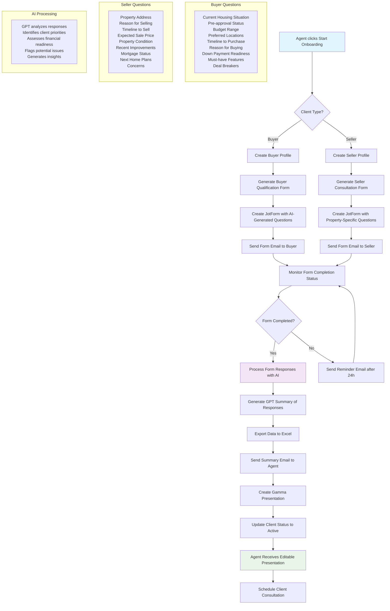

# Client Onboarding Workflow

## Overview
This workflow automates the initial client intake process for both buyers and sellers, streamlining the agent-client relationship setup through AI-powered form generation and automated follow-up sequences.

## Key Features
- **AI-Generated Forms**: Dynamic questionnaires tailored to buyer vs. seller needs
- **Automated Email Sequences**: Professional follow-up communications
- **GPT-Powered Analysis**: Intelligent processing of client responses
- **Presentation Generation**: Automated creation of client consultation materials

## Workflow Diagram

## Process Steps

### 1. Initiation
- Agent clicks "Start Onboarding" button in dashboard
- System prompts for client type (Buyer or Seller)

### 2. Profile Creation
- **Buyer Profile**: Creates buyer record with basic contact information
- **Seller Profile**: Creates seller record including property details

### 3. Form Generation
- **Buyer Forms**: Focus on financial readiness, preferences, and timeline
- **Seller Forms**: Emphasize property details, motivation, and market expectations

### 4. Distribution & Monitoring
- Automated email delivery with professional templates
- Real-time completion status tracking
- Automated reminder system for non-responses

### 5. AI Analysis
- GPT-4 processes all form responses
- Identifies key priorities and potential issues
- Generates actionable insights for agents

### 6. Deliverables
- Excel export of structured data
- Professional presentation for client meetings
- Summary email with key insights
- Updated client status for workflow progression

## Benefits
- **Time Savings**: Reduces manual data entry and follow-up
- **Consistency**: Ensures all clients receive professional intake experience
- **Insights**: AI analysis reveals patterns agents might miss
- **Preparation**: Agents receive comprehensive client profiles before meetings

## Implementation Details
- **Technology**: Firebase for data storage, OpenAI for analysis, JotForm for surveys
- **Security**: Encrypted data transmission and storage
- **Scalability**: Handles multiple concurrent onboarding processes
- **Customization**: Form templates can be customized per brokerage 