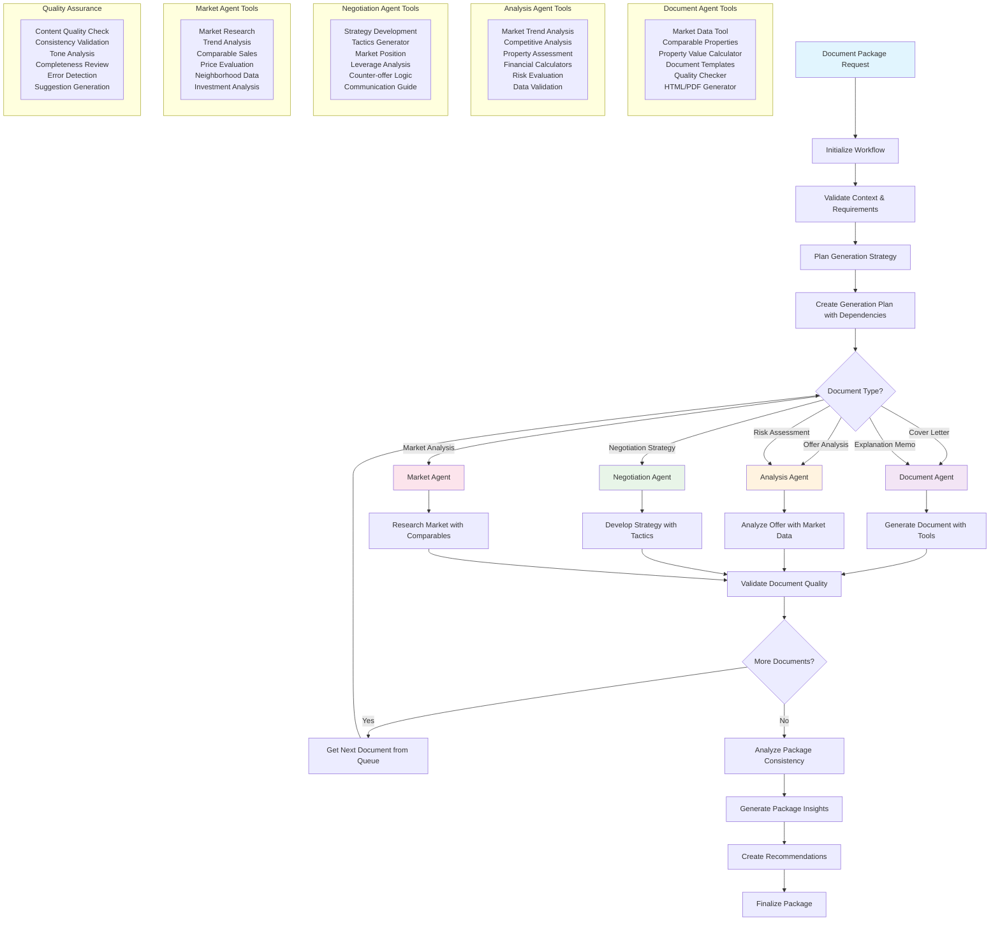

# Document Generation Workflow (LangChain Orchestration)

## Overview
This workflow leverages LangChain agents to generate professional real estate documents using AI orchestration. The system coordinates multiple specialized agents to create cover letters, memos, analyses, and strategies with proper dependency management.

## Key Features
- **Multi-Agent Orchestration**: Specialized agents for different document types
- **Dependency Management**: Intelligent sequencing of document generation
- **Quality Assurance**: Automated validation and consistency checking
- **Tool Integration**: Access to market data, calculators, and templates

## Workflow Diagram

## Agent Specializations

### 1. Document Agent
- **Purpose**: Generate written documents like cover letters and memos
- **Tools**: Template management, content generation, formatting
- **Output**: Professional correspondence and explanatory documents

### 2. Analysis Agent
- **Purpose**: Analyze offers, assess risks, and compare properties
- **Tools**: Financial calculators, market analysis, data validation
- **Output**: Detailed analytical reports and assessments

### 3. Negotiation Agent
- **Purpose**: Develop negotiation strategies and tactics
- **Tools**: Strategy frameworks, leverage analysis, communication guides
- **Output**: Strategic memos and negotiation playbooks

### 4. Market Agent
- **Purpose**: Research market conditions and trends
- **Tools**: Market data APIs, comparable sales, neighborhood analysis
- **Output**: Market reports and investment analyses

## Process Flow

### 1. Request Processing
- Validate input context and requirements
- Determine document package type and scope
- Create generation plan with dependencies

### 2. Agent Coordination
- Route documents to appropriate specialized agents
- Manage parallel generation where possible
- Handle dependencies between documents

### 3. Quality Control
- Validate each document for quality and consistency
- Check content accuracy and completeness
- Ensure professional tone and formatting

### 4. Package Assembly
- Analyze overall package consistency
- Generate insights and recommendations
- Finalize complete document package

## Document Types Supported

- **Cover Letters**: Personalized buyer offer letters
- **Explanation Memos**: Client education documents
- **Offer Analysis**: Detailed offer evaluations
- **Risk Assessments**: Property and market risk analysis
- **Negotiation Strategies**: Strategic planning documents
- **Market Analysis**: Market condition reports
- **Client Summaries**: Comprehensive client information

## Technical Implementation

### LangChain Integration
- **Agent Framework**: OpenAI Functions Agent with specialized tools
- **Memory Management**: Conversation memory for context retention
- **Streaming**: Real-time progress updates during generation
- **Error Handling**: Comprehensive error recovery mechanisms

### Tool Registry
- **Market Data Tools**: Access to real estate market information
- **Calculation Tools**: Financial and property value calculators
- **Document Tools**: Template management and formatting utilities
- **Validation Tools**: Quality checking and data validation

## Benefits

- **Consistency**: Standardized document quality across all agents
- **Efficiency**: Parallel processing where dependencies allow
- **Intelligence**: AI-powered content that adapts to context
- **Scalability**: Can handle multiple document requests simultaneously
- **Quality**: Built-in validation and quality assurance processes 