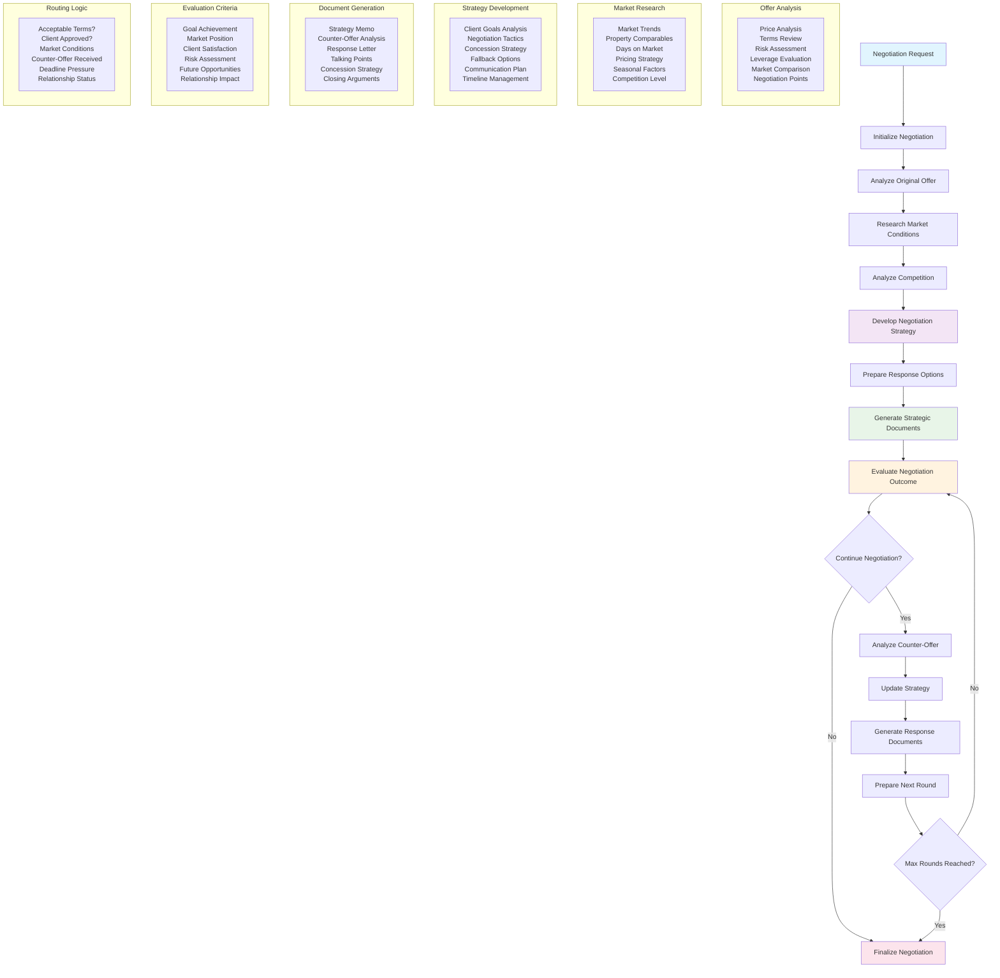

# Negotiation Pipeline Workflow

## Overview
This workflow provides comprehensive negotiation support with multi-round capabilities, strategic analysis, and automated response generation. The system analyzes offers, researches market conditions, develops strategies, and generates professional negotiation documents.

## Key Features
- **Multi-Round Negotiation**: Supports complex, extended negotiation processes
- **Strategic Analysis**: Market research and competitive positioning
- **Response Generation**: Automated creation of negotiation documents
- **Outcome Evaluation**: Continuous assessment of negotiation progress

## Workflow Diagram

## Process Phases

### 1. Initial Analysis
- **Offer Evaluation**: Comprehensive analysis of terms, pricing, and conditions
- **Risk Assessment**: Identification of potential issues and concerns
- **Leverage Analysis**: Understanding negotiation strengths and weaknesses

### 2. Market Research
- **Comparable Properties**: Analysis of similar properties and recent sales
- **Market Trends**: Current market conditions and trajectory
- **Competitive Positioning**: Understanding the property's market position

### 3. Strategy Development
- **Goal Alignment**: Ensuring strategy matches client objectives
- **Tactical Planning**: Specific negotiation moves and responses
- **Contingency Planning**: Fallback options and alternative approaches

### 4. Document Generation
- **Strategy Memos**: Internal strategy documentation for agents
- **Response Letters**: Professional communications to counterparties
- **Talking Points**: Structured guidance for verbal negotiations

### 5. Outcome Evaluation
- **Progress Assessment**: Measuring advancement toward goals
- **Market Alignment**: Ensuring continued market relevance
- **Relationship Management**: Maintaining professional relationships

## Multi-Round Negotiation Support

### Round Management
- **State Persistence**: Maintains context across negotiation rounds
- **Strategy Evolution**: Adapts strategy based on counterparty responses
- **Document History**: Tracks all communications and offers

### Escalation Handling
- **Deadline Management**: Monitors critical dates and deadlines
- **Concession Tracking**: Records all concessions made by both parties
- **Relationship Monitoring**: Assesses impact on long-term relationships

## Document Types Generated

### Strategic Documents
- **Negotiation Strategy Memo**: Comprehensive strategic overview
- **Leverage Analysis**: Assessment of negotiation strengths
- **Risk Mitigation Plan**: Strategies for managing identified risks

### Response Documents
- **Counter-Offer Letters**: Professional response communications
- **Talking Points**: Structured guidance for verbal negotiations
- **Concession Proposals**: Structured concession offerings

### Analysis Documents
- **Offer Comparison**: Side-by-side analysis of offers
- **Market Position Report**: Property's competitive standing
- **Outcome Projections**: Predicted negotiation results

## Technical Implementation

### LangGraph Workflow
- **State Management**: Comprehensive state tracking across rounds
- **Conditional Routing**: Dynamic workflow paths based on context
- **Error Recovery**: Robust error handling and recovery mechanisms

### Agent Integration
- **Negotiation Agent**: Strategy development and tactical planning
- **Analysis Agent**: Offer and market analysis
- **Document Agent**: Professional document generation
- **Market Agent**: Market research and competitive analysis

### Decision Points
- **Continue/Finalize**: Assessment of whether to continue negotiating
- **Strategy Adjustment**: Determining when to modify approach
- **Escalation Triggers**: Identifying when to escalate or de-escalate

## Benefits

### For Agents
- **Strategic Guidance**: Professional-level negotiation strategies
- **Time Efficiency**: Automated analysis and document generation
- **Consistency**: Standardized approach across all negotiations
- **Professional Quality**: High-quality documents and communications

### For Clients
- **Better Outcomes**: Data-driven negotiation strategies
- **Transparency**: Clear documentation of negotiation process
- **Professional Representation**: High-quality communications
- **Strategic Positioning**: Optimal market positioning

## Success Metrics

- **Goal Achievement Rate**: Percentage of negotiations meeting client goals
- **Time to Resolution**: Average negotiation duration
- **Client Satisfaction**: Feedback on negotiation process and outcomes
- **Market Performance**: Comparison to market averages
- **Relationship Preservation**: Maintenance of professional relationships 