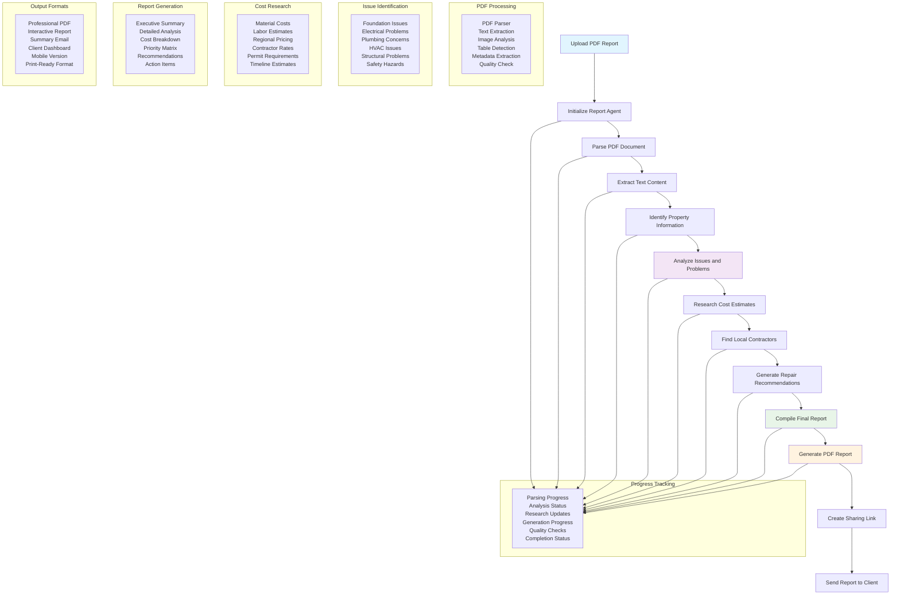

# Report Generation Workflow

## Overview
This workflow automates the analysis of inspection reports and other property documents, extracting key information, identifying issues, researching costs, and generating comprehensive analysis reports for real estate professionals and their clients.

## Key Features
- **PDF Processing**: Advanced text extraction and document parsing
- **Issue Identification**: AI-powered detection of property problems
- **Cost Research**: Automated repair cost estimation and contractor research
- **Professional Reports**: Generation of detailed, actionable reports

## Workflow Diagram

## Process Stages

### 1. Document Upload & Initialization
- **File Validation**: Ensures uploaded file is a valid PDF
- **Agent Initialization**: Sets up the report generation agent
- **Progress Tracking**: Establishes real-time progress monitoring

### 2. PDF Processing
- **Text Extraction**: Converts PDF content to analyzable text
- **Image Analysis**: Processes embedded images and diagrams
- **Table Detection**: Identifies and extracts tabular data
- **Metadata Extraction**: Captures document properties and information

### 3. Property Information Extraction
- **Address Identification**: Locates and validates property address
- **Inspection Date**: Extracts inspection date and details
- **Property Type**: Identifies residential, commercial, or other property types
- **Inspector Information**: Captures inspector credentials and contact details

### 4. Issue Analysis & Identification
- **Systematic Review**: Comprehensive analysis of all report sections
- **Issue Categorization**: Groups problems by system (electrical, plumbing, etc.)
- **Severity Assessment**: Ranks issues by urgency and impact
- **Safety Evaluation**: Identifies immediate safety concerns

### 5. Cost Research & Estimation
- **Market Research**: Analyzes current material and labor costs
- **Regional Adjustments**: Applies local pricing variations
- **Contractor Research**: Identifies qualified local contractors
- **Timeline Estimation**: Provides realistic completion schedules

### 6. Report Generation
- **Executive Summary**: High-level overview for quick review
- **Detailed Analysis**: Comprehensive breakdown of all findings
- **Cost Breakdown**: Itemized repair and improvement costs
- **Priority Matrix**: Recommended order of repairs and improvements

## Issue Categories Analyzed

### Structural Systems
- **Foundation**: Cracks, settling, water damage
- **Framing**: Structural integrity, load-bearing elements
- **Roofing**: Leaks, wear, structural damage
- **Windows/Doors**: Sealing, operation, security

### Mechanical Systems
- **HVAC**: Heating, ventilation, air conditioning
- **Plumbing**: Water supply, drainage, fixtures
- **Electrical**: Wiring, panels, safety compliance
- **Insulation**: Energy efficiency, moisture control

### Safety & Compliance
- **Fire Safety**: Smoke detectors, escape routes
- **Code Compliance**: Building code violations
- **Environmental**: Asbestos, lead paint, radon
- **Security**: Locks, lighting, entry points

## Output Components

### Executive Summary
- **Key Findings**: Most important issues identified
- **Total Cost Estimate**: Overall repair and improvement costs
- **Priority Recommendations**: Immediate vs. future actions
- **Safety Alerts**: Critical safety issues requiring immediate attention

### Detailed Analysis
- **System-by-System Review**: Comprehensive analysis of each building system
- **Issue Descriptions**: Detailed explanation of each problem
- **Photographic Evidence**: Referenced images and documentation
- **Technical Recommendations**: Specific repair approaches

### Cost Breakdown
- **Itemized Estimates**: Individual cost for each repair
- **Labor vs. Materials**: Breakdown of cost components
- **Contingency Planning**: Buffer for unexpected issues
- **Financing Options**: Potential funding approaches

### Action Plan
- **Priority Matrix**: Ranking of repairs by urgency and cost
- **Timeline Recommendations**: Suggested completion schedules
- **Contractor Referrals**: Qualified local service providers
- **Permit Requirements**: Necessary permits and inspections

## Real-Time Progress Updates

### Processing Stages
- **Document Upload**: File reception and validation
- **Parsing Progress**: PDF processing completion percentage
- **Analysis Status**: Issue identification progress
- **Research Updates**: Cost research and contractor lookup status

### User Interface Updates
- **Progress Bar**: Visual indication of completion status
- **Status Messages**: Descriptive updates on current activities
- **Estimated Time**: Remaining time for completion
- **Error Notifications**: Immediate alerts for any issues

## Technical Implementation

### PDF Processing Engine
- **Library**: PDF-parse for text extraction
- **Image Processing**: Computer vision for image analysis
- **Table Recognition**: Pattern recognition for tabular data
- **Quality Assurance**: Validation of extraction accuracy

### AI Analysis System
- **Natural Language Processing**: Text analysis and understanding
- **Pattern Recognition**: Issue identification and categorization
- **Cost Modeling**: Predictive cost estimation algorithms
- **Knowledge Base**: Extensive database of repair costs and procedures

### Report Generation Engine
- **Template System**: Professional report templates
- **Dynamic Content**: Context-aware content generation
- **Multi-Format Output**: PDF, HTML, and mobile-friendly formats
- **Branding Integration**: Agent and brokerage branding options

## Benefits

### For Agents
- **Time Savings**: Automated analysis reduces manual review time
- **Professional Quality**: Consistently high-quality reports
- **Client Value**: Enhanced service offering to clients
- **Market Advantage**: Differentiation from competitors

### For Clients
- **Clarity**: Easy-to-understand analysis and recommendations
- **Actionable Information**: Clear next steps and priorities
- **Cost Transparency**: Detailed cost estimates and options
- **Decision Support**: Data-driven information for negotiations

### For the Industry
- **Standardization**: Consistent report quality and format
- **Efficiency**: Faster turnaround on property analysis
- **Accuracy**: Reduced human error in issue identification
- **Innovation**: Advanced technology application in real estate 