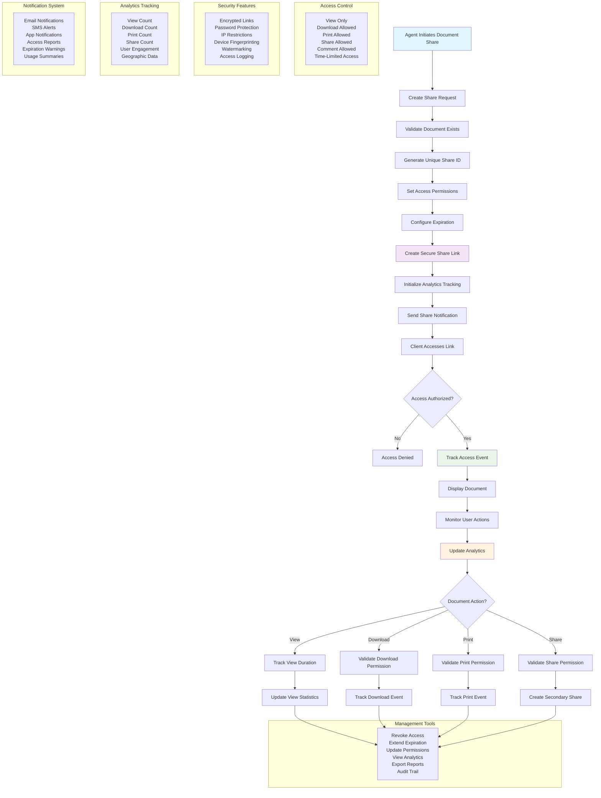

# Document Sharing Workflow

## Overview
This workflow provides secure document sharing capabilities for real estate professionals, featuring access controls, expiration management, usage analytics, and professional client communication. The system ensures sensitive documents are shared safely while providing detailed tracking and management capabilities.

## Key Features
- **Secure Link Generation**: Encrypted sharing links with unique identifiers
- **Access Control**: Granular permissions for viewing, downloading, printing
- **Analytics Tracking**: Comprehensive usage monitoring and reporting
- **Professional Management**: Agent-friendly interface for share management

## Workflow Diagram

## Share Creation Process

### 1. Share Request Initiation
- **Document Selection**: Agent selects document from library
- **Recipient Specification**: Enter client email addresses
- **Purpose Definition**: Specify reason for sharing document

### 2. Access Configuration
- **Permission Levels**: Define what recipients can do with document
- **Expiration Settings**: Set automatic expiration date/time
- **Security Options**: Configure password protection, IP restrictions

### 3. Link Generation
- **Unique Identifier**: Create cryptographically secure share ID
- **Encryption**: Apply end-to-end encryption to sharing link
- **Metadata Storage**: Store sharing configuration and permissions

### 4. Distribution
- **Email Notification**: Send professional email with access instructions
- **SMS Alerts**: Optional text message notifications
- **Access Instructions**: Clear guidance for document access

## Access Control Features

### Permission Types
- **View Only**: Recipients can only view the document
- **Download Allowed**: Permission to download document copies
- **Print Allowed**: Permission to print document
- **Share Allowed**: Permission to create secondary shares
- **Comment Allowed**: Permission to add comments or annotations

### Security Measures
- **Password Protection**: Optional password requirement for access
- **IP Address Restrictions**: Limit access to specific IP ranges
- **Device Fingerprinting**: Track and validate accessing devices
- **Watermarking**: Add identifying marks to viewed/printed documents
- **Session Timeouts**: Automatic session expiration for security

### Time-Based Controls
- **Expiration Dates**: Automatic access revocation after specified time
- **Access Windows**: Limit access to specific time periods
- **Usage Limits**: Maximum number of views, downloads, or prints
- **Extension Options**: Ability to extend access when needed

## Analytics & Tracking

### Access Metrics
- **View Tracking**: Number of views and view duration
- **Download Monitoring**: Track all document downloads
- **Print Logging**: Monitor printing activities
- **Geographic Data**: Location information for access events

### User Engagement
- **Session Duration**: Time spent viewing documents
- **Page/Section Views**: Detailed viewing patterns within documents
- **Return Visits**: Frequency of repeated access
- **Device Information**: Types of devices used for access

### Reporting Features
- **Usage Reports**: Comprehensive access and usage statistics
- **Client Reports**: Individual client activity summaries
- **Audit Trails**: Complete chronological access logs
- **Export Options**: CSV, PDF, and Excel report formats

## Notification System

### Automated Notifications
- **Share Created**: Confirmation to agent when share is created
- **First Access**: Alert when document is first accessed
- **Download Events**: Notification when document is downloaded
- **Expiration Warnings**: Alerts before access expires

### Customizable Alerts
- **Real-Time Notifications**: Immediate alerts for critical events
- **Summary Reports**: Daily/weekly usage summaries
- **Custom Triggers**: Agent-defined notification conditions
- **Multi-Channel Delivery**: Email, SMS, and in-app notifications

## Management Tools

### Share Administration
- **Active Share List**: View all currently active shares
- **Share Status**: Monitor access status and usage
- **Bulk Management**: Manage multiple shares simultaneously
- **Search & Filter**: Find specific shares quickly

### Control Actions
- **Revoke Access**: Immediately disable document access
- **Extend Expiration**: Modify expiration dates as needed
- **Update Permissions**: Change access permissions after creation
- **Reset Links**: Generate new secure links if needed

### Analytics Dashboard
- **Visual Reports**: Charts and graphs showing usage patterns
- **Client Insights**: Individual client engagement metrics
- **Document Performance**: Track which documents are most accessed
- **Trend Analysis**: Identify patterns in document sharing and access

## Security & Compliance

### Data Protection
- **Encryption**: All documents encrypted at rest and in transit
- **Access Logging**: Comprehensive logs for all access attempts
- **Data Retention**: Configurable retention policies for shared documents
- **Privacy Controls**: Compliance with privacy regulations

### Compliance Features
- **Audit Trails**: Complete tracking for regulatory compliance
- **Data Export**: Export capabilities for compliance reporting
- **Retention Policies**: Automatic cleanup of expired shares
- **Access Controls**: Role-based access for internal users

## Technical Implementation

### Backend Infrastructure
- **Secure Storage**: Encrypted document storage system
- **Database**: Comprehensive tracking and metadata storage
- **API Integration**: RESTful APIs for all sharing operations
- **Scalability**: Support for high-volume sharing requirements

### Frontend Interface
- **Intuitive UI**: User-friendly interface for agents
- **Mobile Responsive**: Full functionality on mobile devices
- **Real-Time Updates**: Live updates on share status and analytics
- **Integration**: Seamless integration with document library

## Benefits

### For Agents
- **Professional Image**: High-quality, secure document sharing
- **Time Efficiency**: Streamlined sharing process with automation
- **Client Insights**: Understanding of client engagement with documents
- **Compliance**: Meeting professional standards for document security

### For Clients
- **Easy Access**: Simple, secure access to important documents
- **Transparency**: Clear understanding of document permissions
- **Professional Experience**: High-quality presentation of documents
- **Security Assurance**: Confidence in document protection

### For Brokerages
- **Brand Protection**: Consistent, professional document sharing
- **Compliance**: Meeting regulatory requirements for document handling
- **Analytics**: Insights into document usage and client engagement
- **Security**: Enterprise-level security for sensitive documents 