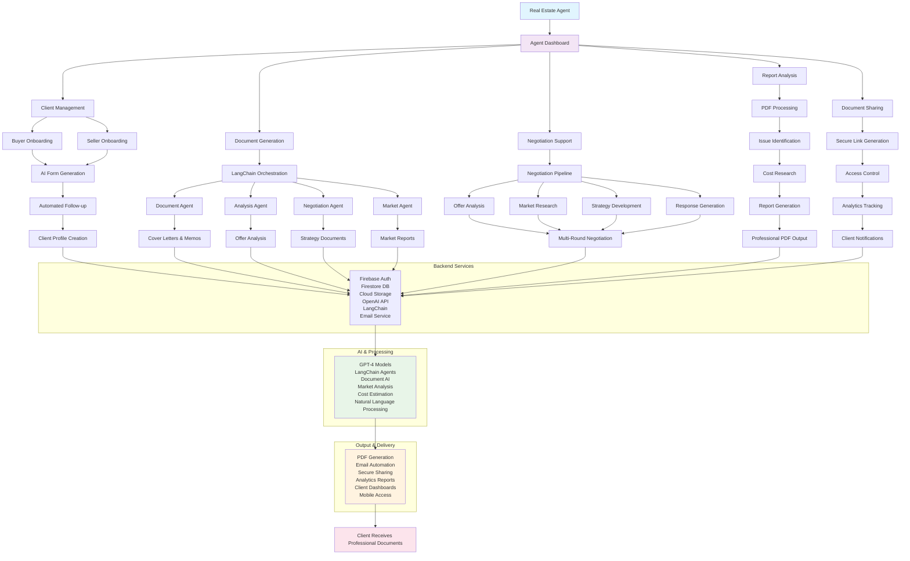

# System Architecture & Workflow Integration Overview

## Overview
This diagram illustrates how all workflow automations integrate within the Real Estate Agentic platform, showing the complete system architecture and the relationships between different components, services, and user interactions.

## Key Features
- **Unified Platform**: All workflows integrated in a single desktop application
- **Agent-Centric Design**: Everything designed around empowering real estate agents
- **AI-Powered Automation**: LangChain agents and OpenAI integration throughout
- **Professional Output**: High-quality documents and client experiences

## Complete System Architecture

## System Components

### 1. Agent Dashboard (Central Hub)
- **Purpose**: Single interface for all agent activities
- **Features**: Navigation, status monitoring, quick access to all tools
- **Design**: Professional, intuitive interface optimized for agent workflows

### 2. Client Management System
- **Buyer Onboarding**: Automated qualification and intake process
- **Seller Onboarding**: Property-focused consultation workflows
- **Profile Management**: Comprehensive client information storage
- **Relationship Tracking**: History of all interactions and documents

### 3. Document Generation Engine
- **LangChain Orchestration**: Multi-agent document creation system
- **Specialized Agents**: Document, Analysis, Negotiation, and Market agents
- **Quality Assurance**: Automated validation and consistency checking
- **Professional Output**: High-quality, branded documents

### 4. Negotiation Support Platform
- **Strategy Development**: AI-powered negotiation planning
- **Multi-Round Support**: Extended negotiation management
- **Response Generation**: Automated creation of negotiation documents
- **Outcome Tracking**: Performance monitoring and analysis

### 5. Report Analysis System
- **PDF Processing**: Advanced document parsing and analysis
- **Issue Identification**: AI-powered problem detection
- **Cost Estimation**: Automated repair cost research
- **Professional Reports**: Comprehensive analysis documents

### 6. Document Sharing Infrastructure
- **Secure Distribution**: Encrypted, controlled document sharing
- **Access Management**: Granular permission controls
- **Analytics Tracking**: Comprehensive usage monitoring
- **Professional Presentation**: Branded, client-friendly interfaces

## Technology Stack

### Frontend (Electron + React)
- **Desktop Application**: Cross-platform Electron app
- **User Interface**: React with TypeScript for type safety
- **Styling**: Tailwind CSS for professional, responsive design
- **Component Library**: shadcn/ui for consistent, accessible components

### Backend Services
- **Authentication**: Firebase Auth for secure user management
- **Database**: Firestore for scalable, real-time data storage
- **Storage**: Firebase Cloud Storage for document and media files
- **Email**: Automated email services for client communication

### AI & Processing
- **Language Models**: OpenAI GPT-4 for content generation and analysis
- **Agent Framework**: LangChain for AI agent orchestration
- **Document Processing**: Advanced PDF parsing and text extraction
- **Market Analysis**: AI-powered market research and trend analysis

### Security & Compliance
- **Encryption**: End-to-end encryption for all sensitive data
- **Access Control**: Role-based permissions and authentication
- **Audit Trails**: Comprehensive logging for compliance
- **Data Protection**: Privacy-focused design and data handling

## Workflow Integration Points

### Data Flow
1. **Client Input**: Information flows from onboarding forms
2. **AI Processing**: Multiple agents analyze and enhance data
3. **Document Generation**: Professional outputs created automatically
4. **Secure Distribution**: Documents shared with access controls
5. **Analytics Collection**: Usage and engagement tracking

### Cross-Workflow Dependencies
- **Client Profiles**: Feed into all document generation workflows
- **Market Data**: Shared across negotiation and analysis workflows
- **Document Library**: Central repository for all generated content
- **Analytics Data**: Informs strategy and process improvements

### Real-Time Synchronization
- **Status Updates**: Live progress tracking across all workflows
- **Notification System**: Immediate alerts for important events
- **Collaborative Features**: Multi-user access with conflict resolution
- **Mobile Synchronization**: Consistent experience across devices

## Agent Empowerment Philosophy

### Human-in-the-Loop Design
- **AI Enhancement**: Technology amplifies rather than replaces human expertise
- **Professional Judgment**: Agents maintain control over all client interactions
- **Relationship Focus**: Tools support relationship building, not automation
- **Quality Assurance**: Human oversight ensures professional standards

### Professional Development
- **Skill Enhancement**: Tools help agents develop better practices
- **Market Intelligence**: AI provides insights for better decision-making
- **Efficiency Gains**: Automation frees time for high-value activities
- **Competitive Advantage**: Modern tools differentiate agent services

## Client Experience Benefits

### Professional Quality
- **Consistent Branding**: All outputs reflect professional standards
- **Timely Delivery**: Automated processes ensure quick turnaround
- **Comprehensive Service**: Complete coverage of transaction lifecycle
- **Transparent Communication**: Clear, professional communications

### Enhanced Service
- **Personalized Attention**: AI enables more customized service
- **Expert Analysis**: Professional-grade market and property analysis
- **Proactive Communication**: Automated updates and notifications
- **Secure Handling**: Enterprise-level security for sensitive information

## Business Model: B2B2C

### Agent Benefits (B2B)
- **Enhanced Capabilities**: Professional tools for better client service
- **Competitive Differentiation**: Modern technology sets agents apart
- **Efficiency Improvements**: More clients served with higher quality
- **Professional Development**: Continuous learning and improvement

### Client Benefits (B2C via Agents)
- **Better Education**: Comprehensive understanding of real estate processes
- **Informed Decisions**: Data-driven insights for major decisions
- **Professional Experience**: High-quality service throughout transaction
- **Ongoing Support**: Resources extend beyond closing

## Scalability & Growth

### Technical Scalability
- **Cloud Infrastructure**: Serverless architecture for automatic scaling
- **Modular Design**: Components can be updated independently
- **API Integration**: Extensible system for third-party integrations
- **Performance Optimization**: Efficient resource utilization

### Business Scalability
- **Multi-Tenant Support**: Serve multiple brokerages simultaneously
- **Customization Options**: Brokerage-specific branding and features
- **Training Programs**: Comprehensive agent onboarding and education
- **Support Systems**: Dedicated customer success and technical support

This integrated system represents the "brokerage of the future" by providing comprehensive AI-powered tools that enhance agent capabilities while maintaining the crucial human connection that defines successful real estate relationships. 